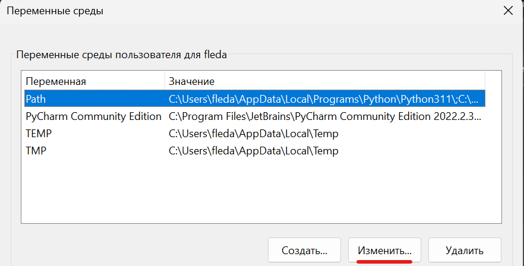
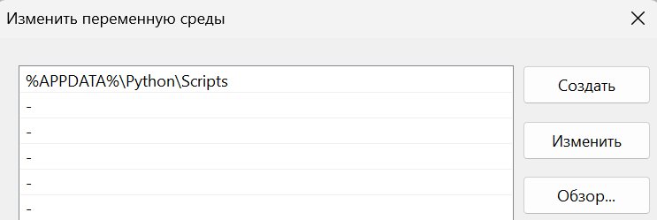

# Установка Poetry
Откройте терминал и запустите команду `pip install poetry`

После успешной установки для работы команды poetry нам нужно добавить путь к скриптам Python в переменную окружения Path. Для этого в поиске Windows находим **Изменение переменных среды текущего пользователя**

В открывшемся окне находим переменную Path и нажимаем изменить

Добавляем следующую переменную: `%APPDATA%\Python\Scripts`

Сохраняем изменения и снова открываем терминал. \
Poetry установлен! \
Проверить работоспособность можно следующей командой: `poetry --version`